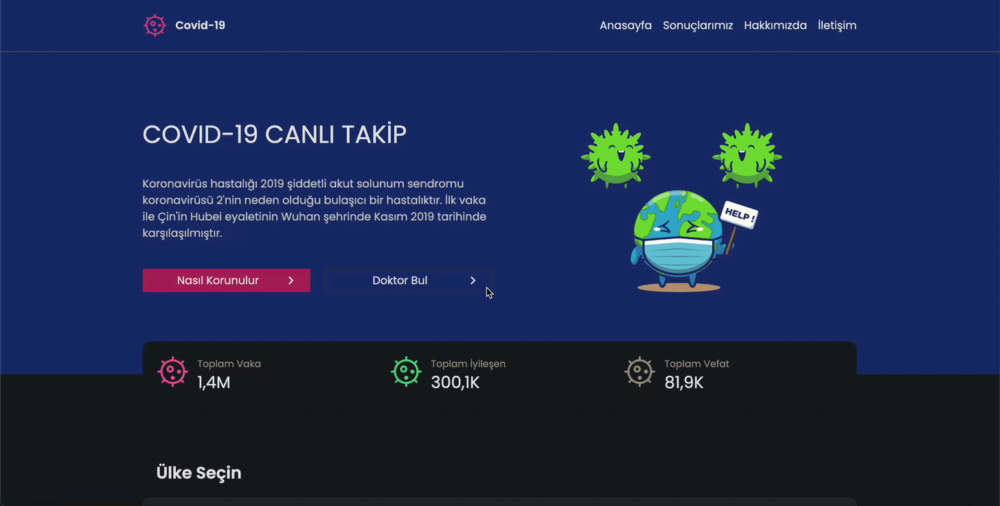

# COVID-19 Tracker

This project is a web application designed to track COVID-19 cases worldwide. It visualizes real-time data and allows users to access statistics by country.

## Features

- **Global Statistics**: Total cases, recoveries, and deaths worldwide.
- **Country-Specific Details**: COVID-19 statistics for each country.
- **Map Visualization**: Interactive map using React Simple Maps.
- **Responsive Design**: Mobile-friendly design with Tailwind CSS.
- **Real-Time Data**: Fetch up-to-date data from an API using Axios.

## Technologies Used

- **React**: For building the user interface.
- **Redux Toolkit**: For global state management.
- **Axios**: For making API requests.
- **React Simple Maps**: For map visualization.
- **Tailwind CSS**: For styling and design.
- **Millify**: To format large numbers into readable formats.
- **React Router DOM**: For page routing.

